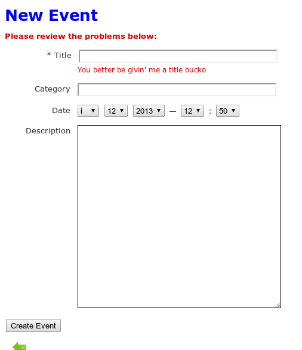

### Event Tracker  (CodeFellows - App A Day)

This micro app tracks important dates and sorts them base on date scheduled.  Only events in the future will be displayed.

### Concepts Utilized
* Sorting in Controller
* Adding Pictures for Buttons/Links
* Limited I18n Support: Option to view page in Pirate language. Go to localhost:3000/pirate/
* Simple Form For gem used
* Time Formatting in .yml file

## Show Me

Screenshots:

Pirate Errors

## Project Setup

No known specialized instillation instructions.

`git clone git@github.com:tuckerd/event_tracker.git`
`rake db:setup`
`rails s`
Go to browser and go to localhost:3000

### Known Issues

If you discover any bugs, feel free to create an issue on GitHub fork and
send us a pull request.

## Contributing

1. Fork it
2. Create your feature branch (`git checkout -b my-new-feature`)
3. Commit your changes (`git commit -am 'Add some feature'`)
4. Push to the branch (`git push origin my-new-feature`)
5. Create new Pull Request

## License

The MIT License (MIT)
